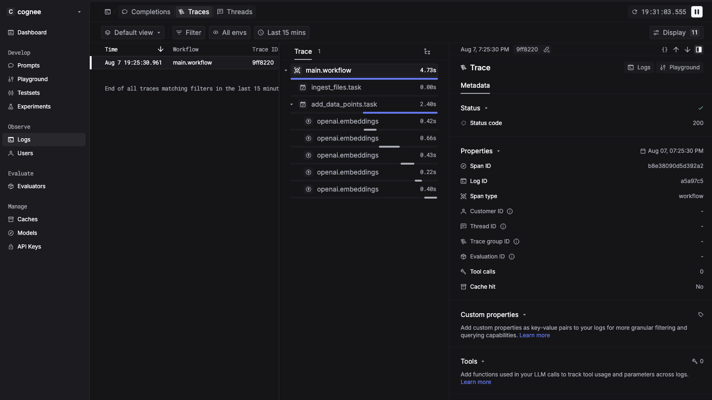

# Cognee Community • Keywords AI Observability

```bash
pip install cognee-community-observability-keywordsai

export LLM_API_KEY=<your_OpenAI_key>
export MONITORING_TOOL=keywordsai
export KEYWORDSAI_API_KEY=<your_KeywordsAI_key>
```


## 2  Example

File path `packages/observability/keywordsai/examples/observability_keywordsai_demo/example.py`

```python
import cognee_community_observability_keywordsai  # noqa: F401  <-- side‑effect!

import os, json, asyncio
from typing import List, Any

from cognee import prune, visualize_graph
from cognee.low_level import setup, DataPoint
from cognee.modules.data.methods import load_or_create_datasets
from cognee.modules.users.methods import get_default_user
from cognee.pipelines import run_tasks, Task
from cognee.tasks.storage import add_data_points as _add_data_points

from cognee.modules.observability.get_observe import get_observe
observe = get_observe()          # returns Keywords AI decorator

# ---------------- DataPoint models ---------------- #
class Person(DataPoint):
    name: str
    metadata = {"index_fields": ["name"]}

class Department(DataPoint):
    name: str
    employees: list[Person]
    metadata = {"index_fields": ["name"]}

class CompanyType(DataPoint):
    name: str = "Company"
    metadata = {"index_fields": ["name"]}

class Company(DataPoint):
    name: str
    departments: list[Department]
    is_type: CompanyType
    metadata = {"index_fields": ["name"]}

# ---------------- Tasks ---------------- #
@observe                    # task span “ingest_files”
def ingest_files(data: List[Any]):
    people_dp, dept_dp, companies_dp = {}, {}, {}
    for item in data:
        people, companies = item["people"], item["companies"]
        for p in people:
            person = people_dp[p["name"]] = Person(name=p["name"])
            dept_dp.setdefault(
                p["department"], Department(name=p["department"], employees=[])
            ).employees.append(person)

        company_type = CompanyType()
        for c in companies:
            comp = companies_dp[c["name"]] = Company(
                name=c["name"], departments=[], is_type=company_type
            )
            for d in c["departments"]:
                comp.departments.append(
                    dept_dp.setdefault(d, Department(name=d, employees=[]))
                )
    return companies_dp.values()

add_data_points = observe(_add_data_points)  # task span “add_data_points”

# ---------------- Workflow ---------------- #
@observe(workflow=True)     # workflow span “main”
async def main():
    await prune.prune_data(); await prune.prune_system(metadata=True)
    await setup()

    user = await get_default_user()
    ds = await load_or_create_datasets(["test_dataset"], [], user)

    base = os.path.dirname(__file__)
    companies = json.load(open(os.path.join(base, "companies.json")))
    people    = json.load(open(os.path.join(base, "people.json")))
    data = [{"companies": companies, "people": people}]

    pipeline = run_tasks(
        [Task(ingest_files), Task(add_data_points)],
        dataset_id=ds[0].id,
        data=data,
        incremental_loading=False,
    )
    async for s in pipeline: print(s)

    out = os.path.join(base, ".artifacts/graph_visualization.html")
    await visualize_graph(out)
    return out

if __name__ == "__main__":
    asyncio.run(main())

```



